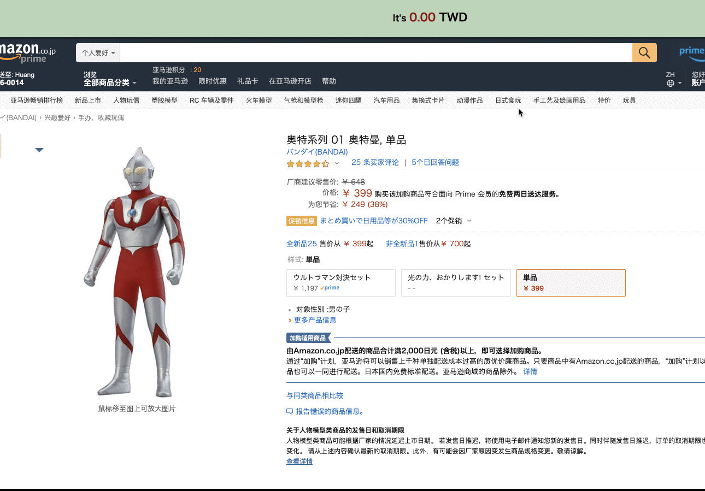

# currency-converter-elm

Convert JPY to TWD from your favorite website.

Inspired by [elm-chrome-extension](https://github.com/danneu/elm-chrome-extension)

This experimental project demonstrates a Chrome extension composed of
three Elm applications that communicate through Chrome's
message passing.

The three apps:

1. The persistent background app that runs globally for the duration
   of the browser session.
   - It holds the state and the other apps subscribe to state updates.
2. The content-script app runs on each website tab.

The content-script and popup apps use one-way messaging to trigger
actions in the background app.

Every time the background app model updates, it broadcasts to all
listeners which replace their model with the new version.

## Development

Git clone and then `npm install`.

Build the extension into the `dist/` folder:

    npm run build

Build to `dist/` and rebuild on file changes:

    npm run watch

Once built, load the `dist/` folder as an extension in Chrome's UI.